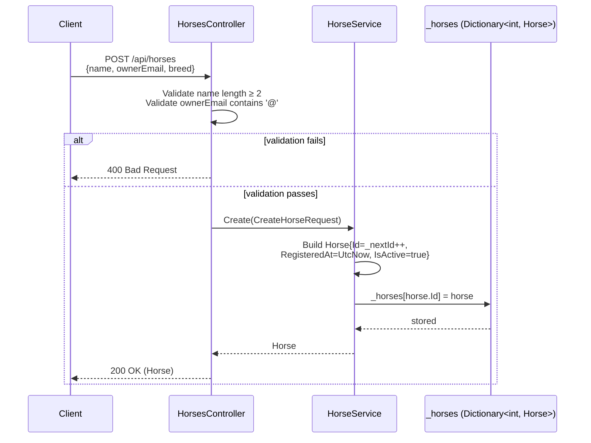

# Register-a-Horse Flow

```mermaid
sequenceDiagram
    participant Client
    participant HorsesController
    participant HorseService
    participant Dictionary as _horses (Dictionary<int, Horse>)

    Client->>HorsesController: POST /api/horses<br/>{name, ownerEmail, breed}
    HorsesController->>HorsesController: Validate name length ≥ 2<br/>Validate ownerEmail contains '@'
    alt validation fails
        HorsesController-->>Client: 400 Bad Request
    else validation passes
        HorsesController->>HorseService: Create(CreateHorseRequest)
        HorseService->>HorseService: Build Horse{Id=_nextId++,<br/>RegisteredAt=UtcNow, IsActive=true}
        HorseService->>Dictionary: _horses[horse.Id] = horse
        Dictionary-->>HorseService: stored
        HorseService-->>HorsesController: Horse
        HorsesController-->>Client: 200 OK (Horse)
    end
```
